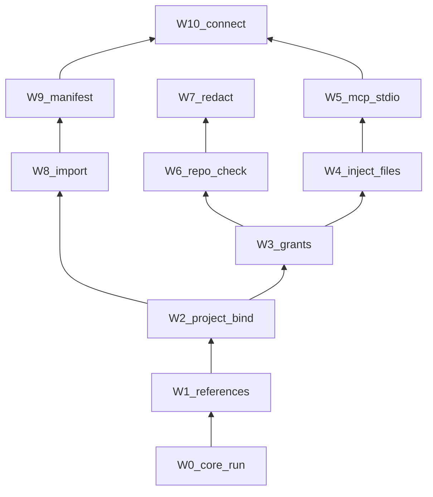

# Veil workstack — grow toward HASP

This is expansion. Vesper ordered it. The current product is still the tiny run-broker.

Veil does not become HASP. Veil grows the same job: a local broker that keeps secret values out of agent context. HASP’s license (FCL), telemetry, and seven agent profiles are not copied.

License stays GPL-3. No network in the Core. No telemetry at any layer.

## Current ground (do not rewrite)

Already shipped:

- Vault (Argon2id + AES-GCM)
- Session daemon, lock, wipe, idle timeout
- `run` injects into one child environment
- `set` / `unset` / `list` / `log` / `explain` / `erase`
- No `get`

HASP’s six objects. Veil owns two and a half:

```text
Vault → Project → Target → Consumer → Grant → Broker
  yes      no       no        no        no      run only
```

## Laws that do not move

1. Core stays: encrypt, unlock, inject into a child, lock, wipe. Policy does not enter `vault.py` or the wipe path.
2. Filter observes and denies. It does not become a second vault.
3. Application is MCP, manifests, connect helpers. It must exist before any store copy claims “works with Cursor.”
4. Galvenais I–VII always (Philosophia Vesperi v1.2). Veil is not AI-wrapped: no TRAIGA banner, no fake “you are talking to AI.” If a later layer invokes a model, stop and apply V-B.
5. Refuse HASP telemetry, even opt-in. Refuse a default `reveal` / `get`. Refuse a cloud control plane. Refuse an HTTP MITM proxy (that is Agent Vault, a different job).

## The stack

Read bottom to top. Do not start a layer while the one under it is unfinished.

```text
W10  Consumer connect (generic MCP first; named profiles last)
W9   Value-free manifests / targets
W8   Import (.env / JSON) by explicit command
W7   Redaction of managed values in output Veil controls
W6   Repo leak check + optional hooks
W5   MCP stdio broker (list, run, inject — never get)
W4   inject: broker-owned temp files, then wipe
W3   Grants: actor × project × action × once|session|window
W2   Project binding: this repo may name these secrets
W1   References: @NAME handles; values still never printed
W0   Reinforce current loop (done)
```



### W0 — Reinforce (closed)

Use the current CLI on this machine with a throwaway secret. If `run` / `explain` / `erase` fail, stop the stack and fix. Engine before face.

### W1 — References

Filter. The agent may see `@OPENAI_API_KEY`. It must not see the value.

- Parse `--env NAME=@REF` on `run`.
- Optional alias: vault item `OPENAI_API_KEY`, project name `secret_01`.
- Logs and MCP list emit refs only.
- Still no `get`.

Done when: a command can request `@REF` and the transcript contains only the handle.

### W2 — Project binding

Filter. A vault on one laptop is not a global dictionary.

- `veil project bind` at a repo root.
- Binding lists which refs that root may name.
- `veil run` requires cwd (or `--project-root`) inside a bound root, or it denies.
- Unbind and erase still remove the binding files.

Done when: repo A cannot resolve a secret bound only to repo B.

### W3 — Grants

Filter. Possession is not permission.

- A grant is actor + project + action (`run` | `inject`) + time (`once` | `session` | `window`).
- Operator issues the grant. Veil does not invent one.
- `run` without a matching grant denies and logs `denied`.
- Grant records are local, erasable, never contain values.

Done when: unlock alone is not enough; a scoped grant is required for delivery.

### W4 — inject

Same broker, second delivery path. Some tools need a file, not an env var.

- `veil inject --file PATH=@REF -- <cmd>`
- File lives in a broker-owned temp path, mode user-only, wiped after the child exits.
- Do not write repo-visible `.env` here.

Done when: a child can read a temp credential file, and the file is gone after `run`.

### W5 — MCP stdio

Application. This is the first HASP-shaped agent surface.

Tools (names may change; jobs may not):

- `veil_list` — refs visible in this project
- `veil_run` — brokered command
- `veil_inject` — brokered temp file
- `veil_explain` — same text as `veil explain`

No tool returns a raw secret. Generic stdio server first. One client (Cursor) as proof. Not seven profiles.

Done when: Cursor can finish one real task through MCP without the value appearing in the chat.

### W6 — Repo leak check

Filter. Backup, not the design.

- `veil check` scans the bound root for known managed values.
- Optional hooks, installed only by operator command (`veil hooks install`).
- Default hook: block commit when a managed value is in the tree.

Done when: a planted vault value in a tracked file is reported and can block a commit.

### W7 — Redaction

Filter. Last fence for output Veil itself prints (not the child’s stdout we do not own).

- Before Veil prints MCP or CLI errors it controls, wipe known values.
- Child stdout of `run` is the child’s. Do not pretend we can redact a hostile process.

Done when: a Veil-controlled message cannot echo a managed value.

### W8 — Import

Application. Consent is the command.

- `veil import --from .env` / `--from file.json`
- Operator confirms each name. Nothing is scraped from the repo in the background.

Done when: an existing `.env` becomes vault items without Veil reading it unless asked.

### W9 — Manifests

Application. Value-free contract in the repo.

- `.veil.manifest.json` lists targets and refs. No values.
- `veil run --target NAME` expands one declared subset through W3 + W4.

Done when: a repo can name `test` and `deploy` as different ref sets, still with grants.

### W10 — Consumer connect

Application last. Packaging follows a working MCP loop.

- `veil connect cursor` writes local MCP config to the generic server.
- Other agents: generic docs, not first-class wrappers, until Cursor’s loop is boring.
- Named profiles (Claude Code, Codex, Aider, …) only after the generic path is stable.

Done when: a new operator binds, grants, connects, and runs one brokered task without asking Vesper.

## Parked (not in this stack)

| HASP feature | Why parked |
|---|---|
| Opt-in telemetry | Surveillance. Hard no. |
| `reveal` / `copy` / `get` | Breaks the veil. Operator can use another tool. |
| `write-env` | Writes secrets into the repo. If ever added: explicit `--yes`, never default. |
| Homebrew / signed upgrade fetch | Network in the install path. Ship a file. |
| Seven first-class agent profiles | Expand after W10 is dull. |
| Fair Core License | Veil stays GPL-3. |
| HTTP credential proxy | Agent Vault’s job. Split the product if you want that. |

## Suggested cuts

Ship as named Veil versions, not one leap:

| Version | Layers | Public sentence |
|---|---|---|
| 1.x | W0 | Local run-broker. One child command. |
| 1.1 | W1–W3 | Same machine, this repo, this grant. |
| 1.2 | W4–W5 | Agent talks to Veil, not to the key. |
| 1.3 | W6–W7 | Check the tree. Redact what Veil prints. |
| 1.4 | W8–W10 | Import, manifest, connect. Loop closed for an agent. |

## How we work this

- One layer at a time. Unfinished layer = no next layer.
- Each layer: tests first for deny paths, then the grant path.
- README claims only what that version actually does.
- If a layer needs network, telemetry, or `get`, it is a rupture. Stop and tell Vesper.

You approve every change. You deploy.
